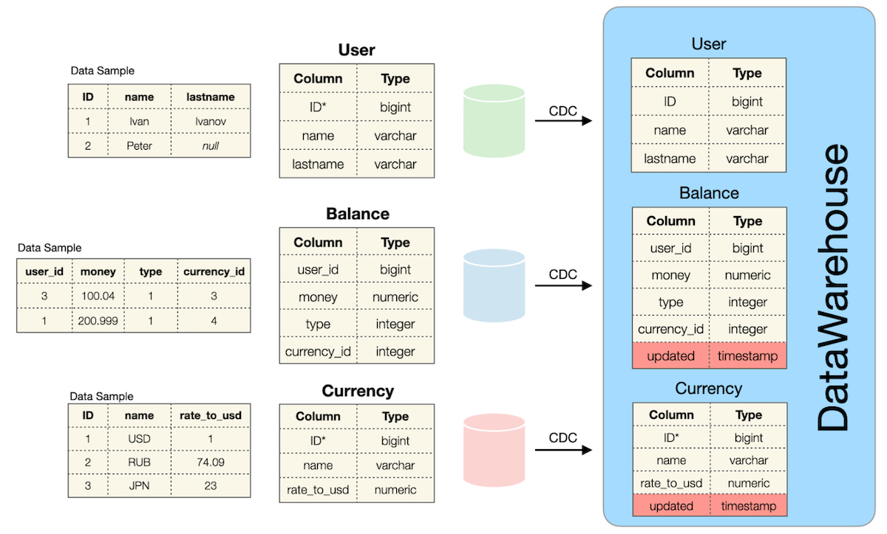
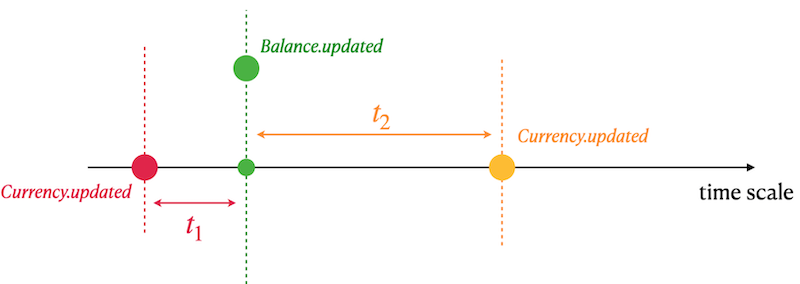

# Data Warehouse

## Упражнение 00 — Классическое хранилище данных



Обзора источников данных в DWH.

`User` — определение таблицы (зеленая):

| Имя столбца | Описание             |
| ----------- | -------------------- |
| ID          | Первичный ключ       |
| name        | Имя пользователя     |
| lastname    | Фамилия пользователя |

`Currency` — определение таблицы (красная):

| Имя столбца | Описание                       |
| ----------- | ------------------------------ |
| ID          | Первичный ключ                 |
| name        | Название валюты                |
| rate_to_usd | Курс валюты по отношению к USD |

`Balance` — определение таблицы (синяя):

| Имя столбца | Описание                                                            |
| ----------- | ------------------------------------------------------------------- |
| user_id     | «Виртуальный внешний ключ» на таблицу User из другого источника     |
| money       | Денежная сумма                                                      |
| type        | Тип баланса (может принимать значения 0, 1, ...)                    |
| currency_id | «Виртуальный внешний ключ» на таблицу Currency из другого источника |

Эти базы данных являются независимыми источниками данных и соответствуют микросервисному подходу. В связи с этим был учтён высокий риск возникновения аномалий в данных.

* Таблицы не обеспечивают согласованность данных. Это означает, что пользователь может существовать в таблице `User`, но отсутствовать в таблице `Balance`, и наоборот — в `Balance` может существовать запись, для которой отсутствует соответствующий пользователь в `User`. Аналогичная ситуация возможна между таблицами `Currency` и `Balance`. Иными словами, явные внешние ключи между таблицами отсутствуют.
* В таблице `User` допускаются значения `NULL` для полей `name` и `lastname`.
* Все таблицы работают с OLTP (OnLine Transactional Processing) SQL-трафиком. Это означает, что в них хранится текущее состояние данных на определённый момент времени, а исторические изменения по каждой таблице не сохраняются.

Перечисленные три таблицы были использованы в качестве источников данных для таблиц с аналогичными моделями данных в области DWH.

`User` — определение таблицы (в базе данных DWH):

| Имя столбца | Описание             |
| ----------- | -------------------- |
| ID          | Первичный ключ       |
| name        | Имя пользователя     |
| lastname    | Фамилия пользователя |

`Currency` — определение таблицы (в базе данных DWH):

| Имя столбца | Описание                                        |
| ----------- | ----------------------------------------------- |
| ID          | Имитационный первичный ключ                     |
| name        | Название валюты                                 |
| rate_to_usd | Курс валюты по отношению к USD                  |
| updated     | Временная метка события из исходной базы данных |

`Balance` — определение таблицы (в базе данных DWH):

| Имя столбца | Описание                                                            |
| ----------- | ------------------------------------------------------------------- |
| user_id     | «Виртуальный внешний ключ» на таблицу User из другого источника     |
| money       | Денежная сумма                                                      |
| type        | Тип баланса (может принимать значения 0, 1, ...)                    |
| currency_id | «Виртуальный внешний ключ» на таблицу Currency из другого источника |
| updated     | Временная метка события из исходной базы данных                     |

Под `Mocked Primary Key` подразумевался случай, когда для одного и того же `ID` существуют дубликаты, поскольку было добавлено новое изменившееся атрибутивное значение. Это преобразовало реляционную модель в темпоральную реляционную модель.

Был рассмотрен пример данных для валюты `"EUR"`.
Пример был основан на следующем SQL-запросе:

```sql
SELECT *
FROM Currency
WHERE name = ‘EUR’
ORDER BY updated DESC;
```

| ID  | name | rate_to_usd | updated          |
| --- | ---- | ----------- | ---------------- |
| 100 | EUR  | 0.9         | 03.03.2022 13:31 |
| 100 | EUR  | 0.89        | 02.03.2022 12:31 |
| 100 | EUR  | 0.87        | 02.03.2022 08:00 |
| 100 | EUR  | 0.9         | 01.03.2022 15:36 |
| ... | ...  | ...         | ...              |


Был рассмотрен следующий пример данных.
Пример был основан на следующем SQL-запросе:

```sql
SELECT *
FROM Balance
WHERE user_id = 103
ORDER BY type, updated DESC;
```

| user_id | money | type | currency_id | updated          |
| ------- | ----- | ---- | ----------- | ---------------- |
| 103     | 200   | 0    | 100         | 03.03.2022 12:31 |
| 103     | 150   | 0    | 100         | 02.03.2022 11:29 |
| 103     | 15    | 0    | 100         | 03.03.2022 08:00 |
| 103     | -100  | 1    | 102         | 01.03.2022 15:36 |
| 103     | 2000  | 1    | 102         | 12.12.2021 15:36 |
| ...     | ...   | ...  | ...         | ...              |

При работе с таблицами DWH были учтены все аномалии, унаследованные из исходных таблиц.

* Таблицы не обеспечивают согласованность данных.
* В таблице `User` допускаются значения `NULL` для полей `name` и `lastname`.

В рамках задания был написан SQL-запрос, возвращающий общий объём (сумму всех `money`) транзакций из баланса пользователей с агрегацией по пользователю и типу баланса. При расчёте были обработаны все данные, включая данные с аномалиями.

Результирующие столбцы формировались следующим образом:

| Выходной столбец    | Формула (псевдокод)                                                                                                                                                                      |
| ------------------- | ---------------------------------------------------------------------------------------------------------------------------------------------------------------------------------------- |
| name                | источник: `user.name`; если `user.name` равен `NULL`, возвращалось значение `not defined`                                                                                                |
| lastname            | источник: `user.lastname`; если `user.lastname` равен `NULL`, возвращалось значение `not defined`                                                                                        |
| type                | источник: `balance.type`                                                                                                                                                                 |
| volume              | источник: `balance.money`; суммировались все денежные «движения»                                                                                                                         |
| currency_name       | источник: `currency.name`; если `currency.name` равен `NULL`, возвращалось значение `not defined`                                                                                        |
| last_rate_to_usd    | источник: `currency.rate_to_usd`; для соответствующей валюты выбиралось последнее значение `currency.rate_to_usd`; если `currency.rate_to_usd` равен `NULL`, использовалось значение `1` |
| total_volume_in_usd | использовались `volume` и `last_rate_to_usd`; выполнялось умножение `volume` на `last_rate_to_usd`                                                                                       |

Результат отсортирован по имени пользователя в порядке убывания, а затем по фамилии пользователя и типу баланса в порядке возрастания.

| name | lastname    | type | volume | currency_name | last_rate_to_usd | total_volume_in_usd |
| ---- | ----------- | ---- | ------ | ------------- | ---------------- | ------------------- |
| Петр | not defined | 2    | 203    | not defined   | 1                | 203                 |
| Иван | Иванов      | 1    | 410    | EUR           | 0.9              | 369                 |
| ...  | ...         | ...  | ...    | ...           | ...              | ...                 |


## Упражнение 01 — Детализированный запрос



Перед выполнением основного запроса были применены следующие `INSERT`-операции:

```sql
insert into currency values (100, 'EUR', 0.85, '2022-01-01 13:29');
insert into currency values (100, 'EUR', 0.79, '2022-01-08 13:29');
```

В рамках задания был написан SQL-запрос, возвращающий всех пользователей и все транзакции из таблицы `Balance`. Валюты, для которых отсутствовал ключ в таблице `Currency`, были исключены.

Для каждой транзакции были получены название валюты и рассчитанное значение валюты в USD в ближайший доступный день.

Результирующие столбцы формируются следующим образом:

| Выходной столбец | Формула (псевдокод)                                                                                                                                                              |
| ---------------- | -------------------------------------------------------------------------------------------------------------------------------------------------------------------------------- |
| name             | источник: `user.name`; если `user.name` равен `NULL`, возвращалось значение `not defined`                                                                                        |
| lastname         | источник: `user.lastname`; если `user.lastname` равен `NULL`, возвращалось значение `not defined`                                                                                |
| currency_name    | источник: `currency.name`                                                                                                                                                        |
| currency_in_usd  | использовались `currency.rate_to_usd`, `currency.updated` и `balance.updated`; значение курса определялось на основе ближайшего доступного курса относительно времени транзакции |

При расчёте `currency_in_usd` была реализована следующая логика:

* Сначала находилось ближайшее значение `rate_to_usd` для соответствующей валюты в прошлом (`t1`).
* Если значение `t1` отсутствовало, то находилось ближайшее значение `rate_to_usd` для соответствующей валюты в будущем (`t2`).
* Для расчёта значения валюты в USD использовался курс `t1` или `t2` — в зависимости от того, какой из них был доступен.

Результат отсортирован по имени пользователя в порядке убывания, а затем по фамилии пользователя и названию валюты в порядке возрастания.

| name | lastname | currency_name | currency_in_usd |
| ---- | -------- | ------------- | --------------- |
| Иван | Иванов   | EUR           | 150.1           |
| Иван | Иванов   | EUR           | 17              |
| ...  | ...      | ...           | ...             |
