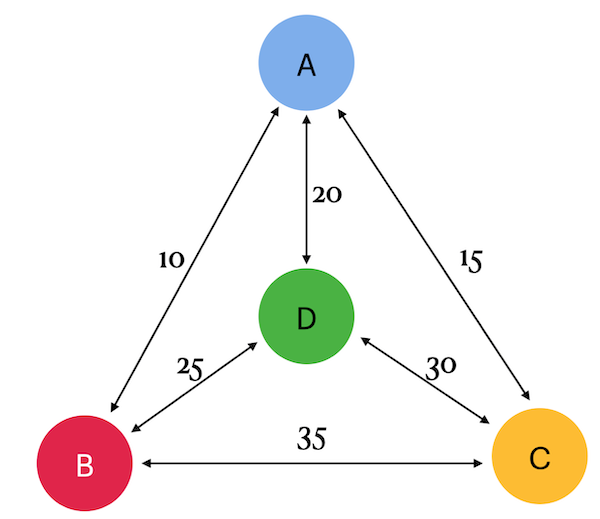

# Traveling Salesman Problem

## Упражнение 00 — Классическая задача коммивояжёра

В рамках задания был рассмотрен граф, содержащий 4 города (`a`, `b`, `c` и `d`) и дуги между ними с указанной стоимостью (или тарифом). Стоимость перемещения между двумя городами считалась одинаковой в обоих направлениях: `(a,b) = (b,a)`.

Была создана таблица с именованными узлами со следующей структурой:

`{point1, point2, cost}`

Таблица была заполнена данными на основе представленного графа. Для каждой пары городов были учтены как прямые, так и обратные пути.

Затем был реализован SQL-запрос, который с помощью рекурсивного запроса находил все возможные маршруты, начинающиеся в городе `a`, проходящие через все города и возвращающиеся в исходную точку.

В результате были определены маршруты с минимальной общей стоимостью. Таким образом, для каждого маршрута учитывалась необходимость посетить все города и завершить путешествие в городе `a`.

Пример маршрута имел следующий вид:

`a -> b -> c -> d -> a`

Результирующие данные были отсортированы сначала по `total_cost`, а затем по `tour`.

| total_cost | tour        |
| ---------- | ----------- |
| 80         | {a,b,d,c,a} |
| ...        | ...         |

## Упражнение 01 — Обратная задача коммивояжёра

В рамках задания был расширен SQL-запрос из предыдущего упражнения, чтобы дополнительно отображать маршруты с **максимальной стоимостью путешествия**.

Для этого была сохранена логика построения всех возможных маршрутов с использованием рекурсивного запроса, после чего в результирующем наборе были представлены как наиболее дешёвые, так и наиболее дорогие варианты путешествия.

Как и в предыдущем упражнении, маршрут начинался в городе `a`, проходил через все города и завершался возвращением в исходную точку.

Результирующие данные были отсортированы сначала по `total_cost`, а затем по `tour`.

| total_cost | tour        |
| ---------- | ----------- |
| 80         | {a,b,d,c,a} |
| ...        | ...         |
| 95         | {a,d,c,b,a} |
